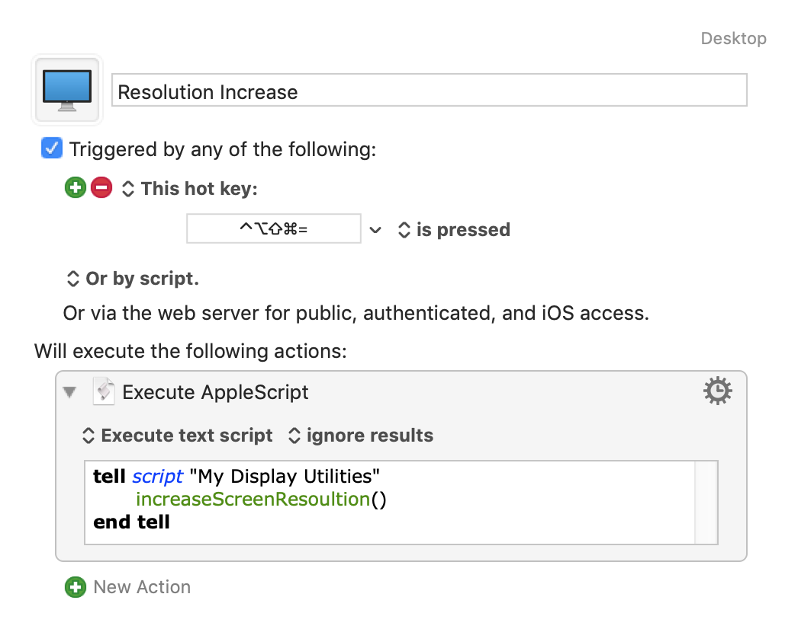
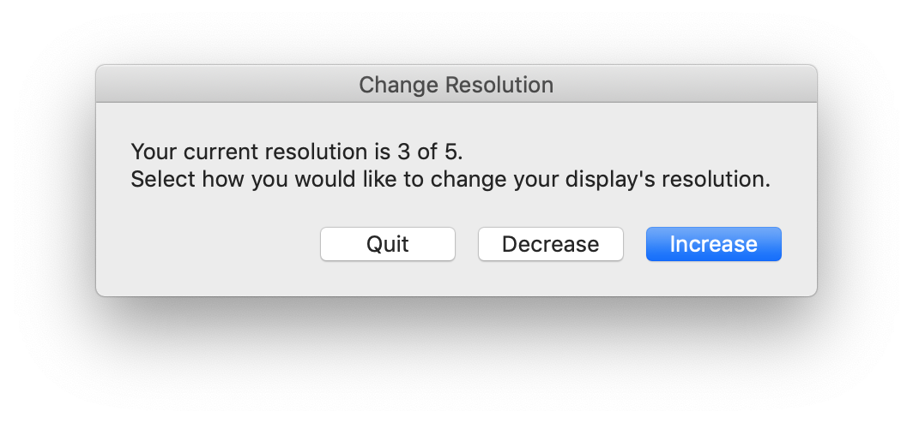
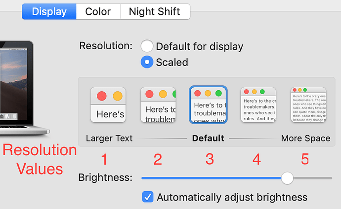

# Script Library for manipulating display resolution

## Purpose

The Change Resolution script allows scripted modification to the display's resolution, making text smaller or larger.

My Macbook Pro 15" display is pretty much just the right size, providing large fonts for my casual viewing. There are times though where I want to bump the resolution up to see more of my windows and text. I got tired of manually going to System Preferences and adjusting the display resolution, so I created a set of AppleScript routines to do it for me. I’m sharing here in case it might be useful to others.

## Usage

### Library

The key script is a set of Library Functions in `My Display Utilities.applescript`. This script contains functions to

- Get the current resolution
- Set it to a specific value
- Increment the resolution
- Decrement the resolution

### Simple Invocation

In the `Keyboard Maestro` folder are two [Keyboard Maestro](https://www.keyboardmaestro.com/main/) that increment and decrement the reolution via a sigle keystroke. Here is an example of the Increment macro:

### Driver Script

The `Change Resolution` is script is an interactive Applescript wrapper around the Library. When run, you will be presented with an interactive dialog, allowing the resolution to be incremented and decremented.

## Installation

Installing the scripts can be performed automatically by running the `build.sh` script from a Terminal. This script

1. Compiles the `.applescript` plain-text files into `.scpt` files
1. Copies the compiled `Change Resolution` script to the User Scripts folder, where it will be accessable from the Menu Bar's Script Menu
1. Copies the compiled `My Display Utilities` script to the User Script Libraries folder, where it can be accessed by any other Applescript.

You may optionally import the Keyboard Maestro script files to get one-key resolution change.

## Background

In the macOS _Sytem Preferences_ app, there are 5 options for changing the display resolution

This script refers to them as resolution numbers 1 through 5, where

- 1 provides the largest text, corresponding to a low resolution
- 3 is the system default
- 5 is the smallest text, corresponding to a large resolution

## Caveats

These scripts work on my machines that have built-in displays. If you are using an external monitor, the UI Scripting may not work. If this is the case, please create an Issue with a screenshot of your System Preferences and I'll try to update the script.
